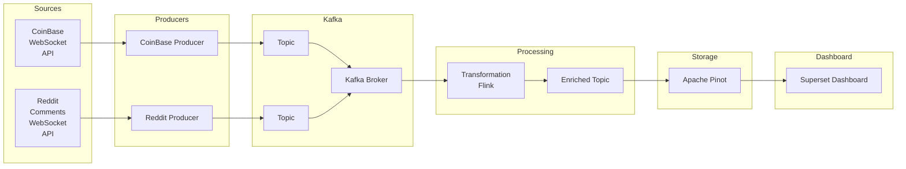

# TODO
- Implement Schema registry V
- Functioning Reddit Producer V
- Flink Transformation in Java
- Create enriched topics
- Send enriched topics to Apache Pinot
- Create dashboard in ???
- Producer load balancing / Add stress test (Java or Rust) or Ksql datagen
- Based on stress test -> investigate Cloud alternatives for existing services and implement those or optimize Kafka/Flink

# Optional
- New Producer in Java/Rust
- Write tests
- .whl implementation for Python producers
- CICD pipeline

## Project Overview

This project implements a real-time data streaming pipeline that ingests financial related data from multiple sources, processes it, and visualizes the results on a dashboard. The architecture leverages modern streaming and analytics technologies to ensure scalability, reliability, and low-latency insights.

Project uses Confluent platform in Docker. 

### Components

- **Sources**:  
    - *CoinBase WebSocket API*: Streams cryptocurrency market data.
    - *Reddit Comments WebSocket API*: Streams comments about relating subjects

- **Producers**:  
    - Specialized producers connect to each data source and publish raw data to Kafka topics.

- **Kafka**:  
    - Acts as the central message broker, decoupling data producers and consumers.
    - Separate topics are used for each data source.

- **Processing**:  
    - Stream processing frameworks (Flink, Kafka Streams, Faust) transform and enrich the incoming data.
    - The processed data is written to an enriched Kafka topic.

- **Storage**:  
    - *Apache Pinot* stores the enriched data, enabling fast analytical queries.

- **Dashboard**:  
    - *Superset Dashboard* provides interactive visualizations and analytics on the processed data.

### Getting Started

1. **Clone the repository** and install dependencies for each component.
2. **Configure API keys** for CoinBase and Yahoo Finance.
3. **Start Kafka** and create the required topics.
4. **Run the producers** to begin ingesting data.
5. **Launch the stream processing jobs** to transform and enrich the data.
6. **Start Apache Pinot** and set up the schema for the enriched topic.
7. **Deploy Superset** and connect it to Pinot for dashboarding.

### Use Cases

- Real-time monitoring of cryptocurrency and stock prices.
- Historical analysis and visualization of market trends.

### Technologies Used

- Kafka
- Python
- Docker
